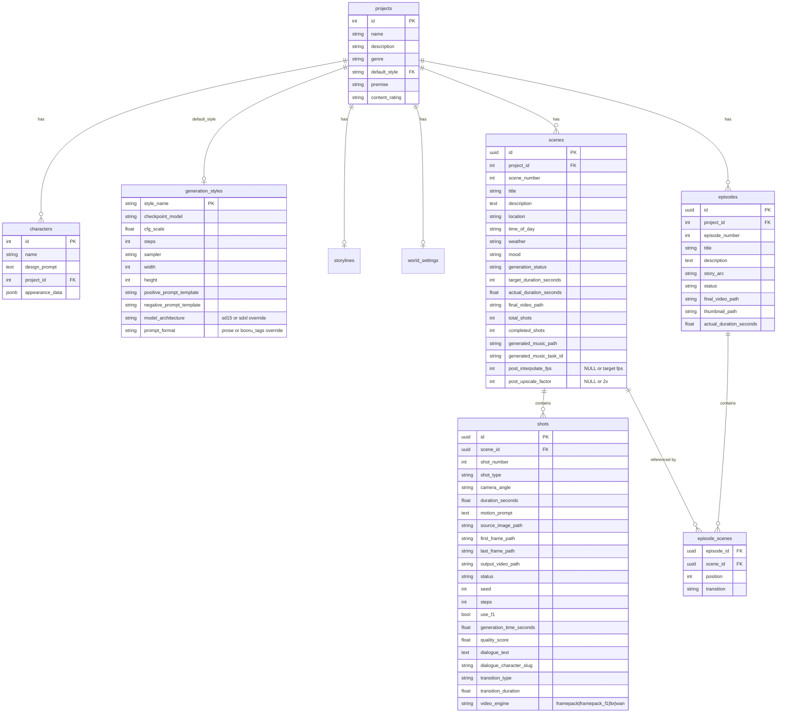

# Anime Studio v3.5 Architecture

## System Overview


## Package Structure

```
packages/
  core/               # Shared infrastructure + autonomy
    __init__.py
    auth.py           # JWT auth middleware (local bypass, external JWT)
    config.py         # Paths, URLs, model names
    db.py             # asyncpg pool, migrations, character cache
    gpu_router.py     # GPU/Ollama status endpoint
    models.py         # Pydantic request/response models
    events.py         # EventBus — async event emitter
    learning.py       # Pattern analysis from gen history/rejections/approvals
    audit.py          # Autonomy decision logging
    model_selector.py # Param recommendations, drift detection, learned negatives
    auto_correction.py # 7 fix strategies for rejected images
    replenishment.py  # Autonomous generation loop (target-based)
    model_profiles.py # Checkpoint-aware prompt translation + param defaults
    generation.py     # Model-aware image generation pipeline
    orchestrator.py   # Production pipeline coordinator (training → video → publish)
    orchestrator_router.py # Orchestrator API endpoints (8 routes)
    graph_sync.py     # Apache AGE graph sync (EventBus-driven)
    graph_queries.py  # Cypher query helpers
    graph_router.py   # Graph analytics endpoints (11 routes)

  story/              # 15 routes
    router.py         # Project CRUD, storyline, world settings, generation styles

  visual_pipeline/    # 5 routes
    router.py         # Vision review endpoint (Gemma3 auto-triage)
    classification.py # Character identification, confusable pair verification
    vision.py         # Image quality assessment, species verification, perceptual hash
    comfyui.py        # Workflow building, submission, progress tracking

  scene_generation/   # 23 routes
    router.py         # Scene/shot CRUD, generate, assemble, video serve, motion presets, story-to-scenes, music, Wan endpoints
    builder.py        # Progressive-gate generation, crossfade assembly, continuity chaining, audio ducking, frame interpolation, video upscaling
    framepack.py      # FramePack workflow building, I2V pipeline, motion presets
    ltx_video.py      # LTX-Video 2B workflow building, native LoRA support
    wan_video.py      # Wan 2.1 T2V workflow, GGUF support, environment/establishing shots
    story_to_scenes.py # AI scene breakdown from storyline (Ollama gemma3:12b)

  episode_assembly/   # 10 routes
    router.py         # Episode CRUD, scene linking, assemble, video serve, publish
    builder.py        # ffmpeg xfade crossfade for multi-scene episodes, thumbnail extraction
    publish.py        # Jellyfin directory structure, symlinks, library scan

  lora_training/      # 32 routes
    router.py         # Dataset browsing, approval, gallery, checkpoints
    training_router.py # Training jobs, regeneration
    ingest_router.py  # Image/video upload, ComfyUI scan, IP-Adapter refine
    feedback.py       # Rejection feedback loop, negative prompt building

  audio_composition/  # 8 routes
    router.py         # Voice ingestion, transcription, ACE-Step music generation, music cache

  echo_integration/   # 4 routes
    router.py         # Echo Brain chat, prompt enhancement
```

## Database Schema (Key Tables)



## Character Quality Pipeline


## Replenishment Loop (Autonomous)


## Species Verification

Non-human characters (species contains "NOT human") get additional safeguards:

1. **Per-character negative prompts**: `human, human face, human skin, realistic person` added automatically
2. **Species-specific negatives**: star-shaped creatures get `child, boy, girl, humanoid`; mushroom creatures get `human child, boy wearing hat`
3. **Species verification step**: Focused binary question about creature-specific visual traits (shell, scales, fur, etc.)
4. **Auto-approve blocked**: Non-human characters always require manual approval regardless of vision scores

Species checks defined for: turtle, koopa, dinosaur, star-shaped, mushroom, mouse, dragon.

## Scene Builder Pipeline (Progressive Gates)


## Frontend Component Tree


## API Endpoint Groups

| Package | Prefix | Routes | Key Files |
|---------|--------|--------|-----------|
| story | `/projects`, `/storyline`, `/world-settings`, `/generation-styles` | 15 | router.py |
| visual_pipeline | `/approval/vision-review` | 5 | router.py, classification.py, vision.py, comfyui.py |
| scene_generation | `/scenes`, `/scenes/motion-presets`, `/scenes/generate-from-story`, `/scenes/{id}/generate-music`, `/scenes/{id}/attach-music`, `/generate/wan`, `/generate/wan/models` | 23 | router.py, builder.py, framepack.py, ltx_video.py, wan_video.py, story_to_scenes.py |
| episode_assembly | `/episodes`, `/episodes/{id}/scenes`, `/episodes/{id}/assemble`, `/episodes/{id}/publish` | 10 | router.py, builder.py, publish.py |
| lora_training | `/dataset`, `/approval`, `/training`, `/gallery`, `/ingest`, `/feedback` | 32 | router.py, training_router.py, ingest_router.py, feedback.py |
| audio_composition | `/audio`, `/audio/ingest/voice`, `/audio/voice/*`, `/audio/generate-music`, `/audio/music/*` | 8 | router.py |
| echo_integration | `/echo` | 4 | router.py |
| core (orchestrator) | `/orchestrator/status`, `/orchestrator/toggle`, `/orchestrator/initialize`, `/orchestrator/pipeline/{id}`, `/orchestrator/summary/{id}`, `/orchestrator/tick`, `/orchestrator/override`, `/orchestrator/training-target` | 8 | orchestrator.py, orchestrator_router.py |
| core (graph) | `/graph/sync`, `/graph/stats`, `/graph/lineage/*`, `/graph/co-occurrence/*`, `/graph/drift/*`, `/graph/ranking/*`, `/graph/health`, `/graph/feedback/*`, `/graph/cross-project/*` | 11 | graph_sync.py, graph_queries.py, graph_router.py |
| app.py | `/health`, `/gpu/status`, `/events/stats`, `/learning/*`, `/recommend/*`, `/drift`, `/quality/*`, `/correction/*`, `/replenishment/*` | 14 | — |
| **Total** | | **148+** | |

## Hardware

| GPU | Service | Purpose |
|-----|---------|---------|
| NVIDIA RTX 3060 12GB | ComfyUI | Image/video generation (FramePack, FramePack F1, LTX-Video, Wan 2.1 T2V) |
| AMD RX 9070 XT 16GB | Ollama, Echo Brain, ACE-Step | Vision review (Gemma3, Vulkan), embedding generation, AI music generation (ROCm 7.2) |

## Ingestion → Production Pipeline (End-to-End)

```mermaid
graph TD
    subgraph "INGESTION SOURCES"
        YT_IMG[YouTube → Frames<br/>POST /ingest/youtube-project]
        YT_AUD[YouTube → Voice<br/>POST /audio/ingest/voice]
        UPLOAD[Manual Upload<br/>POST /ingest/image]
        COMFY_SCAN[ComfyUI Scan<br/>POST /ingest/scan-comfyui]
        AI_GEN[AI Generation<br/>POST /visual/generate]
        MOVIE[Movie Upload<br/>POST /ingest/movie-upload]
    end

    subgraph "REGISTRATION"
        YT_IMG --> REG[Register to<br/>datasets/slug/images/]
        UPLOAD --> REG
        COMFY_SCAN --> REG
        AI_GEN --> REG
        MOVIE --> |extract frames| REG
        REG --> DEDUP[Dedup + classify]
        DEDUP --> PENDING[approval_status.json<br/>status: pending]
    end

    subgraph "QUALITY REVIEW"
        PENDING --> VISION[Vision Review<br/>Gemma3 auto-triage]
        VISION --> GATE{Quality Score}
        GATE --> |"≥ 0.65 + solo"| AUTO_APP[Auto-Approve]
        GATE --> |"< 0.4"| AUTO_REJ[Auto-Reject]
        GATE --> |"0.4 - 0.65"| MANUAL[Manual Review]
        AUTO_REJ --> FEEDBACK[feedback.json<br/>categories + negatives]
        FEEDBACK --> |regenerate| AI_GEN
    end

    subgraph "TRAINING"
        AUTO_APP --> APPROVED[Approved Dataset]
        MANUAL --> |human approve| APPROVED
        APPROVED --> LORA[LoRA Training<br/>POST /training/start]
    end

    subgraph "VOICE PIPELINE"
        YT_AUD --> SEGMENTS[Speech segments]
        SEGMENTS --> WHISPER[Whisper transcription]
        WHISPER --> VOICE_DATA[Voice samples<br/>+ transcriptions]
    end

    subgraph "SCENE PRODUCTION"
        APPROVED --> |source images| SHOTS[Scene Shots<br/>POST /scenes/{id}/shots]
        VOICE_DATA --> |dialogue| SHOTS
        SHOTS --> PROG_GEN[Progressive Gate Generation<br/>FramePack I2V]
        PROG_GEN --> |quality check + retry| PROG_GEN
        PROG_GEN --> XFADE[Crossfade Assembly<br/>ffmpeg xfade dissolve]
        XFADE --> AUDIO_MIX[Audio Mix<br/>dialogue + ACE-Step music]
    end

    subgraph "DISTRIBUTION"
        AUDIO_MIX --> SCENE_VIDEO[Scene MP4]
        SCENE_VIDEO --> EPISODE[Episode Assembly<br/>multi-scene concat]
        EPISODE --> JELLYFIN[Jellyfin Publish<br/>S01E01 naming]
    end
```

## Episode Assembly Pipeline


## Audio Mixing Pipeline


## Voice Pipeline


## ACE-Step Music Generation

```mermaid
graph LR
    subgraph "Trigger"
        SCENE_MOOD[Scene mood<br/>tense/romantic/action...] --> CAPTION[Build music caption<br/>from MOOD_PROMPTS]
        MANUAL[Manual caption<br/>free-form text] --> CAPTION
    end

    subgraph "ACE-Step (port 8440, AMD GPU)"
        CAPTION --> SUBMIT[POST /generate<br/>task_id returned]
        SUBMIT --> GEN[3.5B model inference<br/>~20s for 30s audio]
        GEN --> OUTPUT[48kHz stereo WAV]
    end

    subgraph "Integration"
        OUTPUT --> CACHE[music_cache/]
        CACHE --> ATTACH[POST /scenes/{id}/attach-music]
        ATTACH --> DB_STORE[(scenes.generated_music_path)]
        DB_STORE --> ASSEMBLY[Scene assembly<br/>auto-picks during mix]
    end
```

## Key Design Decisions

- **Modular packages**: 7 domain packages under `packages/` (+ core), each with own router. Entry point `src/app.py` mounts all routers.
- **Auth middleware**: Local network bypass (192.168.x.x, 127.0.0.1), JWT required for external access via `X-Real-IP` header from nginx
- **Species-aware generation**: `appearance_data` in DB drives per-character negative prompts and vision review checklist
- **Non-human manual review**: Auto-approve disabled for non-human characters because vision models can't reliably distinguish stylized cartoon humans from non-human creatures
- **IP-Adapter integration**: Reference images automatically injected into ComfyUI workflow during generation
- **Background tasks**: Scene generation uses `asyncio.create_task()`, tracked in `_scene_generation_tasks` dict
- **Vault for credentials**: DB password loaded from HashiCorp Vault at startup, env var fallback
- **Character cache**: `_get_char_project_map()` cached 60 seconds to reduce DB queries
- **Ollama KEEP_ALIVE=5m**: Models auto-unload after 5 minutes to free GPU memory for ComfyUI generation
- **FramePack memory**: `gpu_memory_preservation=6.0` required for RTX 3060 (3.5 causes OOM)
- **FramePack + LoRA incompatibility**: FramePack uses HunyuanVideo architecture, NOT Stable Diffusion — SD-based character LoRAs cannot be injected into video generation
- **Progressive quality gates**: Shot generation retries up to 3x with loosening thresholds (0.6→0.45→0.3), +5 steps per retry, new seed each attempt, keeps best result
- **Crossfade transitions**: Shots joined via ffmpeg `xfade` filter (dissolve/fade/fadeblack/wipeleft, 0.3s default overlap) — requires re-encoding but produces seamless results. Falls back to hard-cut if xfade fails
- **Audio ducking**: ffmpeg sidechaincompress replaces flat amix — music volume (30%) automatically dips to ~5% when dialogue present, threshold=0.02, ratio=6:1, attack=200ms, release=1000ms
- **Frame interpolation**: Optional per-scene post-processing via ffmpeg minterpolate (MCI/AOBMC/bidirectional). `scenes.post_interpolate_fps` column controls target fps (NULL=disabled, 60=30→60fps doubling)
- **Video upscaling**: Optional per-scene upscale via ffmpeg lanczos filter. `scenes.post_upscale_factor` column (NULL=disabled, 2=2x resolution). Capped at 1920x1080
- **Multi-engine video**: Per-shot `video_engine` column selects generation engine — FramePack (I2V, highest quality), FramePack F1 (faster I2V), LTX-Video (I2V+T2V, LoRA support), Wan 2.1 T2V (environment shots, no source image needed, GGUF for low VRAM)
- **ACE-Step music generation**: AI music (3.5B model) on AMD RX 9070 XT via ROCm 7.2 nightly. ~20s for 30s of 48kHz stereo WAV. Scene assembly auto-generates from mood if no track assigned
- **Model-aware generation**: `model_profiles.py` maps checkpoint filenames to structured profiles (architecture, prompt_format, quality tags, style stripping, vision hints). `translate_prompt()` adapts design_prompts at generation time — booru tag models get score_9 prefixes and style tag stripping, prose models keep prompts as-is. DB design_prompts never modified. Param cascade: `recommend_params()` (medium+ confidence) > DB `generation_styles` > model profile defaults
- **Dual GPU architecture**: NVIDIA RTX 3060 for ComfyUI (image/video gen), AMD RX 9070 XT for Ollama (Vulkan) + ACE-Step (music gen, ROCm) + Echo Brain (embeddings). No GPU conflicts, parallel execution
- **Episode assembly**: ffmpeg xfade crossfade between scenes (fadeblack default, 0.5s overlap) with fallback to hard-cut concat
- **Jellyfin publishing**: Symlinks (not copies) to avoid doubling disk usage; S01E01 naming convention
- **Audio mixing**: Non-fatal — if TTS or music download fails, scene video is kept without audio
- **Story-to-scenes AI**: Uses Ollama gemma3:12b for scene breakdowns; structured JSON output with retry parsing
- **Motion presets**: Curated per shot type, served via API so frontend stays in sync without hardcoding
- **FastAPI route ordering**: Static paths (`/scenes/motion-presets`, `/scenes/generate-from-story`) must be registered BEFORE dynamic `{scene_id}` routes
