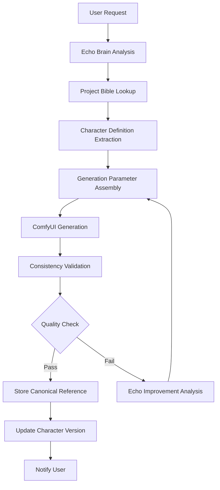

# Character Generation Pipeline API Documentation
## Anime Production System - Character Management & Generation Workflows

### Executive Summary
This document provides comprehensive API documentation for the character generation pipeline in the Tower Anime Production System. The analysis reveals a sophisticated but incomplete character management ecosystem with significant opportunities for Echo Brain orchestration and enhanced workflow automation.

---

## 1. CURRENT CHARACTER GENERATION ENDPOINTS

### 1.1 Core Character Management API (`/opt/tower-anime-production/anime_api.py`)

#### **Project Management Endpoints**
```http
POST   /api/anime/projects                 # Create anime project
GET    /api/anime/projects                 # List all projects
GET    /api/anime/projects/{project_id}    # Get project details
```

#### **Character CRUD Operations**
```http
POST   /api/anime/characters               # Create character definition
GET    /api/anime/characters               # List characters (with project filter)
PUT    /api/anime/characters/{id}          # Update character (increments version)
```

**Character Data Model:**
```json
{
  "id": "integer",
  "project_id": "integer",
  "name": "string",
  "description": "string",
  "version": "integer",              // Auto-incremented on updates
  "image_path": "string",            // Generated image location
  "comfyui_workflow": "string",      // Workflow configuration
  "created_at": "timestamp",
  "updated_at": "timestamp"
}
```

#### **Scene Management (Character Integration)**
```http
POST   /api/anime/scenes                   # Create scene with character list
GET    /api/anime/scenes                   # List scenes by project/branch
PUT    /api/anime/scenes/{id}              # Update scene characters
```

---

## 2. PROJECT BIBLE INTEGRATION SYSTEM

### 2.1 Project Bible API (`/opt/tower-anime-production/project_bible_api.py`)

#### **Bible Management Endpoints**
```http
POST   /api/anime/projects/{id}/bible      # Create project bible
GET    /api/anime/projects/{id}/bible      # Get project bible
PUT    /api/anime/projects/{id}/bible      # Update bible content
```

#### **Character Definition Integration**
```http
POST   /api/anime/bible/characters         # Add character to bible
GET    /api/anime/bible/characters         # Get bible characters
```

**Project Bible Structure:**
```json
{
  "id": "integer",
  "project_id": "integer",
  "title": "string",
  "description": "string",
  "visual_style": {                        // Style consistency rules
    "art_direction": "photorealistic anime",
    "color_palette": ["#hex"],
    "lighting_style": "professional"
  },
  "world_setting": {                       // Environmental context
    "time_period": "cyberpunk future",
    "location": "Neo-Tokyo",
    "atmosphere": "neon-lit urban"
  },
  "narrative_guidelines": {                // Story consistency
    "tone": "dark action",
    "themes": ["revenge", "justice"]
  }
}
```

### 2.2 Character System Integration (`/opt/tower-anime-production/character_system.py`)

#### **Character Definition Loading**
```python
# Character JSON Structure (kai_nakamura.json example)
{
  "name": "Kai Nakamura",
  "gender": "male",
  "appearance": {
    "hair": "dark black hair with electric neon blue streaks",
    "eyes": "left eye bright blue, right eye cyan cybernetic",
    "style": "black tactical military vest with glowing blue circuits"
  },
  "generation_prompts": {
    "visual_description": "detailed character prompt",
    "style_tags": ["photorealistic anime", "cyberpunk"],
    "negative_prompts": ["female", "cartoon"],
    "comfyui_workflow": "photorealistic_anime_character_v2"
  }
}
```

**Character Prompt Generation:**
```python
def build_generation_prompt(character_name, scene_context="", style_override=None)
```

---

## 3. GENERATION PIPELINE ARCHITECTURE

### 3.1 ComfyUI Integration Layer

#### **Primary Generation Service** (Port 8328)
```http
POST   /api/generate                       # Trigger character generation
GET    /api/status/{generation_id}         # Check generation status
GET    /api/queue                          # View generation queue
```

**Generation Parameters:**
```json
{
  "prompt": "character visual description + scene context",
  "character": "character_name",
  "duration": 5,                           // seconds for video
  "frames": 120,                           // 24fps * 5s
  "style": "anime masterpiece",
  "width": 1920,
  "height": 1080,
  "comfyui_workflow": "specified_workflow"
}
```

### 3.2 Character Consistency Engine (`/opt/tower-anime-production/character_consistency_engine.py`)

#### **Advanced Character Validation**
```python
# Character Sheet Generation
async def generate_character_sheet(character_name, project_id) -> Dict[str, Any]

# Consistency Validation
async def validate_character_consistency(character_name, new_image_path) -> Dict[str, Any]
```

**Features:**
- 8-pose reference sheet generation
- Expression bank creation (6 emotions)
- Visual similarity scoring (threshold: 0.85)
- Echo Brain quality assessment integration
- Canonical reference storage with hash verification

---

## 4. ECHO BRAIN ORCHESTRATION LAYER

### 4.1 Current Echo Integration Points

#### **Director Command Processing**
```http
POST   /api/anime/director/command          # Natural language scene commands
```

**Request Format:**
```json
{
  "message": "Generate Kai Nakamura walking through neon alley",
  "context": {
    "project_id": 1,
    "character_requirements": "consistency_priority"
  }
}
```

#### **Echo-Orchestrated Generation**
```http
POST   /api/anime/projects/{id}/generate-from-command
```

**Current Workflow:**
1. Send command to Echo Brain (Port 8309) for interpretation
2. Extract scene parameters from AI response
3. Trigger generation via anime service (Port 8328)
4. Return generation_id for tracking

### 4.2 Echo Character Orchestrator (`character_consistency_engine.py`)

```python
class EchoCharacterOrchestrator:
    async def orchestrate_character_pipeline(character_request) -> Dict[str, Any]
```

**5-Stage Pipeline:**
1. **Requirements Parsing** - Echo NLP analysis
2. **Initial Generation** - ComfyUI integration
3. **Quality Assessment Loop** - Iterative improvements
4. **Consistency Validation** - Automated scoring
5. **Final Approval** - Canonical reference storage

---

## 5. DATABASE SCHEMA ANALYSIS

### 5.1 Current Database Structure (PostgreSQL - `anime_production`)

#### **Core Tables:**
```sql
-- Projects (episodes table - legacy naming)
CREATE TABLE episodes (
    id UUID PRIMARY KEY,
    title VARCHAR(255),
    synopsis TEXT,
    status VARCHAR(50),
    created_at TIMESTAMP,
    updated_at TIMESTAMP,
    metadata JSONB
);

-- Characters (with versioning)
CREATE TABLE characters (
    id SERIAL PRIMARY KEY,
    project_id INTEGER REFERENCES episodes(id),
    name VARCHAR(100),
    description TEXT,
    version INTEGER DEFAULT 1,
    image_path TEXT,
    comfyui_workflow TEXT,
    created_at TIMESTAMP,
    updated_at TIMESTAMP
);

-- Scenes (with character relationships)
CREATE TABLE scenes (
    id SERIAL PRIMARY KEY,
    project_id INTEGER REFERENCES episodes(id),
    branch_name VARCHAR(100) DEFAULT 'main',
    scene_number INTEGER,
    description TEXT,
    characters TEXT,                         // JSON array of character names
    video_path TEXT,
    status VARCHAR(50),
    workflow_data JSONB,                     // Audio, voice metadata
    created_at TIMESTAMP,
    updated_at TIMESTAMP
);
```

#### **Project Bible Schema Extension:**
```sql
-- Project Bible main table
CREATE TABLE project_bibles (
    id SERIAL PRIMARY KEY,
    project_id INTEGER REFERENCES episodes(id),
    title VARCHAR(200),
    description TEXT,
    visual_style JSONB,
    world_setting JSONB,
    narrative_guidelines JSONB,
    created_at TIMESTAMP,
    updated_at TIMESTAMP
);

-- Bible Characters (detailed definitions)
CREATE TABLE bible_characters (
    id SERIAL PRIMARY KEY,
    bible_id INTEGER REFERENCES project_bibles(id),
    name VARCHAR(100),
    description TEXT,
    visual_traits JSONB,
    personality_traits JSONB,
    relationships JSONB,
    evolution_arc JSONB,
    created_at TIMESTAMP
);
```

---

## 6. WORKFLOW GAPS & MISSING FUNCTIONALITY

### 6.1 Critical Missing Endpoints

#### **Character Library Management**
```http
# MISSING - Needed for project bible integration
GET    /api/anime/projects/{id}/bible/characters     # Bible character lookup
POST   /api/anime/characters/from-bible             # Create from bible definition
PUT    /api/anime/characters/{id}/sync-bible        # Sync with bible changes
```

#### **Style Template Persistence**
```http
# MISSING - Needed for consistency
POST   /api/anime/style-templates                   # Save generation templates
GET    /api/anime/style-templates                   # List available templates
POST   /api/anime/characters/{id}/apply-template    # Apply style template
```

#### **User Preference Integration**
```http
# MISSING - Needed for personalization
GET    /api/anime/user/preferences                  # Get user style preferences
PUT    /api/anime/user/preferences                  # Update preferences
POST   /api/anime/characters/generate-preferred     # Generate with user prefs
```

#### **Echo Orchestration Hooks**
```http
# MISSING - Needed for full automation
POST   /api/anime/echo/analyze-character           # Echo character analysis
POST   /api/anime/echo/suggest-improvements        # Echo improvement suggestions
POST   /api/anime/echo/orchestrate-generation      # Full Echo workflow
GET    /api/anime/echo/character-status            # Echo assessment status
```

### 6.2 Database Schema Gaps

#### **Missing Tables:**
```sql
-- Character consistency tracking
CREATE TABLE character_consistency_scores (
    id SERIAL PRIMARY KEY,
    character_id INTEGER REFERENCES characters(id),
    reference_image_path TEXT,
    consistency_score FLOAT,
    validation_date TIMESTAMP,
    echo_assessment JSONB
);

-- Style templates
CREATE TABLE style_templates (
    id SERIAL PRIMARY KEY,
    name VARCHAR(100),
    description TEXT,
    generation_params JSONB,
    created_by VARCHAR(100),
    created_at TIMESTAMP
);

-- User preferences
CREATE TABLE user_preferences (
    id SERIAL PRIMARY KEY,
    user_id VARCHAR(100),
    preference_type VARCHAR(50),
    preference_data JSONB,
    updated_at TIMESTAMP
);
```

---

## 7. RECOMMENDED API ENHANCEMENTS

### 7.1 Project Bible CRUD Operations

#### **Enhanced Bible Management**
```http
POST   /api/anime/projects/{id}/bible/characters           # Add character to bible
GET    /api/anime/projects/{id}/bible/characters/{name}    # Get specific character
PUT    /api/anime/projects/{id}/bible/characters/{name}    # Update character definition
DELETE /api/anime/projects/{id}/bible/characters/{name}    # Remove character

POST   /api/anime/projects/{id}/bible/validate             # Validate bible consistency
GET    /api/anime/projects/{id}/bible/history              # Get revision history
POST   /api/anime/projects/{id}/bible/export               # Export bible as JSON
POST   /api/anime/projects/{id}/bible/import               # Import bible from JSON
```

### 7.2 Character Template Management

#### **Template System**
```http
POST   /api/anime/templates/character                      # Create character template
GET    /api/anime/templates/character                      # List character templates
GET    /api/anime/templates/character/{id}                 # Get template details
PUT    /api/anime/templates/character/{id}                 # Update template
DELETE /api/anime/templates/character/{id}                 # Delete template

POST   /api/anime/characters/{id}/apply-template/{template_id}  # Apply template
POST   /api/anime/characters/{id}/save-as-template         # Save as new template
```

### 7.3 Echo-Coordinated Generation Workflows

#### **Enhanced Echo Integration**
```http
POST   /api/anime/echo/character/analyze                   # Comprehensive character analysis
POST   /api/anime/echo/character/generate                  # Echo-orchestrated generation
POST   /api/anime/echo/character/improve                   # Echo improvement cycle
GET    /api/anime/echo/character/{id}/status               # Get Echo assessment

POST   /api/anime/echo/project/analyze                     # Project-wide analysis
POST   /api/anime/echo/project/optimize                    # Echo optimization suggestions
```

**Echo Generation Request:**
```json
{
  "character_name": "Kai Nakamura",
  "scene_description": "standing confidently in neon alley",
  "generation_mode": "consistency_priority",  // or "creative_exploration"
  "quality_threshold": 0.85,
  "max_iterations": 3,
  "user_preferences": {
    "style": "photorealistic",
    "lighting": "dramatic"
  }
}
```

---

## 8. IMPLEMENTATION PRIORITY MATRIX

### 8.1 High Priority (Immediate Need)

1. **Project Bible Character Integration**
   - API endpoints for bible-character synchronization
   - Character definition inheritance from bible
   - Consistency validation against bible standards

2. **Echo Orchestration Endpoints**
   - Full Echo-coordinated generation pipeline
   - Character analysis and improvement suggestions
   - Quality assessment integration

3. **Character Consistency Tracking**
   - Database schema for consistency scores
   - API endpoints for validation history
   - Reference image management

### 8.2 Medium Priority (Phase 2)

1. **Style Template System**
   - Template creation and management
   - Character template application
   - Template sharing and versioning

2. **User Preference Integration**
   - Preference storage and retrieval
   - Preference-driven generation
   - Personalization analytics

3. **Advanced Analytics**
   - Generation success metrics
   - Character popularity tracking
   - Quality trend analysis

### 8.3 Future Enhancements (Phase 3)

1. **Multi-Character Scene Coordination**
   - Cross-character consistency validation
   - Scene-level character interaction
   - Batch character generation

2. **Advanced Echo Capabilities**
   - Predictive character evolution
   - Narrative-driven character adaptation
   - Automated story-character alignment

---

## 9. INTEGRATION ARCHITECTURE RECOMMENDATIONS

### 9.1 Echo-Driven Character Workflow



### 9.2 Database Integration Strategy

**Recommended Approach:**
1. Extend existing `anime_production` schema
2. Add character consistency tracking tables
3. Implement project bible foreign key relationships
4. Create indexes for performance optimization

**Migration Strategy:**
```sql
-- Phase 1: Add consistency tracking
ALTER TABLE characters ADD COLUMN consistency_score FLOAT;
ALTER TABLE characters ADD COLUMN last_validation_date TIMESTAMP;
ALTER TABLE characters ADD COLUMN echo_assessment JSONB;

-- Phase 2: Add template support
ALTER TABLE characters ADD COLUMN template_id INTEGER;
ALTER TABLE characters ADD COLUMN generation_preferences JSONB;

-- Phase 3: Add user preferences
ALTER TABLE scenes ADD COLUMN user_id VARCHAR(100);
ALTER TABLE characters ADD COLUMN created_by VARCHAR(100);
```

---

## 10. CONCLUSION & NEXT STEPS

### Current System Strengths:
- ✅ Robust character CRUD operations
- ✅ Project bible framework established
- ✅ Character consistency engine foundation
- ✅ Basic Echo Brain integration
- ✅ ComfyUI generation pipeline working

### Critical Gaps to Address:
- ❌ Incomplete bible-character synchronization
- ❌ Missing Echo orchestration endpoints
- ❌ No style template management
- ❌ Limited user preference integration
- ❌ Inconsistent database schema relationships

### Immediate Action Items:
1. Implement project bible character lookup endpoints
2. Create Echo-orchestrated generation workflows
3. Add character consistency tracking database schema
4. Develop style template management system
5. Enhance Echo Brain analysis integration

The anime production system has a solid foundation for character generation but requires enhanced API endpoints and Echo Brain orchestration to achieve Patrick's vision of intelligent, automated, project-driven character creation with consistent styling and user preference memory.