# Anime Production Guidelines - Quality Gates & Character Consistency

## Executive Summary
Based on extensive testing with Kai Nakamura character assets, this document establishes production guidelines for maintaining character consistency while allowing artistic flexibility in anime production.

## Key Finding: Pose Clustering Effect
Character similarity scores cluster by pose type rather than maintaining uniform consistency. Action poses (88% similarity) differ significantly from casual poses (63% similarity) even for the same character.

## Calibrated Quality Gate Thresholds

### Character Type Thresholds (CLIP-based)
| Character Type | Consistency Threshold | Use Case |
|---------------|----------------------|----------|
| **Hero Character** | 75% | Main protagonists with defined look |
| **Supporting Character** | 70% | Recurring characters with flexibility |
| **Background Character** | 65% | Crowd and one-off appearances |
| **Style Reference** | 60% | Art style consistency only |

### Why 75% for Heroes (Not 85%)
- Anime requires **artistic flexibility** for expressions and dynamic poses
- Photorealistic 85% threshold causes 67% failure rate
- 75% threshold achieves 50% pass rate while maintaining identity
- Allows for action vs dialogue scene variations

## Production Best Practices

### 1. Pose-Aware Reference Sets
**Problem**: Single reference cannot capture all character variations

**Solution**: Maintain multiple reference categories per character
```
Character/
├── action/       # Combat and movement poses
├── casual/       # Relaxed and standing poses
├── portrait/     # Close-ups and emotional shots
└── canonical/    # Official character design sheet
```

### 2. Character Consistency Workflow

```mermaid
graph LR
    A[Generate Image] --> B{Check Pose Type}
    B -->|Action| C[Compare to Action Refs]
    B -->|Casual| D[Compare to Casual Refs]
    B -->|Portrait| E[Compare to Portrait Refs]

    C --> F{Score >= 75%?}
    D --> F
    E --> F

    F -->|Yes| G[✅ Accept & Add to Refs]
    F -->|No| H[🔄 Regenerate with Constraints]
```



### 3. Reference Management Rules

#### Automatic Reference Addition
- **Threshold**: >= 90% similarity to existing references
- **Limit**: Maximum 3 references per pose category
- **Rotation**: Oldest reference replaced when limit reached

#### Manual Reference Override
- Required for first character appearance
- Required when changing character design intentionally
- Requires approval from art director role

### 4. Quality Gate Implementation

#### Gate 1: Technical Validation
- Resolution: >= 1024x1024 for production
- Format: PNG or high-quality JPEG
- File integrity: No corruption
- **Pass Rate Target**: 95%

#### Gate 2: Character Consistency
- CLIP similarity: >= 75% for heroes
- Checked against pose-appropriate references
- **Pass Rate Target**: 70%

#### Gate 3: Visual Quality
- Brightness: 0.2 - 0.9 range
- Contrast: >= 0.3
- Sharpness: Laplacian variance >= 100
- **Pass Rate Target**: 85%

#### Gate 4: Creative Review
- Narrative appropriateness
- Emotional expression accuracy
- Scene integration quality
- **Pass Rate Target**: 90%

## Practical Examples

### Example 1: Kai Nakamura Action Sequence
```
Input: "Kai Nakamura in combat stance"
References Used: action/kai_combat_*.png
Threshold: 75%
Expected Similarity: 85-90% (action-to-action)
Result: PASS ✅
```

### Example 2: Kai Nakamura Dialogue Scene
```
Input: "Kai Nakamura sitting casually"
References Used: casual/kai_relaxed_*.png
Threshold: 75%
Expected Similarity: 70-80% (casual-to-casual)
Result: PASS/MARGINAL ⚠️
```

### Example 3: Cross-Pose Comparison
```
Input: "Kai Nakamura portrait"
References Used: action/kai_combat_*.png (wrong category)
Threshold: 75%
Expected Similarity: 60-70% (portrait-to-action)
Result: FAIL ❌
```

## Monitoring & Analytics

### Key Metrics to Track
1. **First-Time Pass Rate**: Target 70% overall
2. **Regeneration Count**: Average < 2 per asset
3. **Reference Growth Rate**: ~10 new refs/week/character
4. **Cross-Pose Contamination**: < 5% wrong category comparisons

### Weekly Review Process
1. Analyze failed generations for patterns
2. Adjust thresholds if pass rate < 60%
3. Audit reference quality (remove outliers)
4. Update pose categories as needed

## Common Issues & Solutions

### Issue: Character looks different in action vs dialogue
**Solution**: Use pose-aware references, not single canonical reference

### Issue: New outfit causes consistency failures
**Solution**: Create new reference branch for outfit variant

### Issue: Background characters failing consistency
**Solution**: Lower threshold to 65%, focus on style over identity

### Issue: Over-rejection of valid variations
**Solution**: Ensure using correct pose category for comparison

## Technical Implementation

### Database Schema Requirements
```sql
-- Pose-aware references
CREATE TABLE character_references (
    id INTEGER PRIMARY KEY,
    character_name TEXT,
    pose_category TEXT, -- 'action', 'casual', 'portrait'
    image_path TEXT,
    embedding BLOB,
    similarity_score REAL
);
```

### API Endpoints
- `POST /api/anime/qc/validate` - Run quality gates
- `POST /api/anime/reference/add` - Add reference with category
- `GET /api/anime/reference/{character}/{pose}` - Get pose-specific refs

## Conclusion

The calibrated 75% threshold with pose-aware references provides the optimal balance between character consistency and artistic flexibility. This system acknowledges that anime characters need to express different emotions and perform various actions while maintaining their core identity.

**Remember**: Perfect consistency (100%) is neither achievable nor desirable in creative production. The goal is recognizable character identity with room for artistic expression.

---

*Last Updated: December 2024*
*Based on: Kai Nakamura production data analysis*
*System: Tower Anime Production Pipeline v2.0*