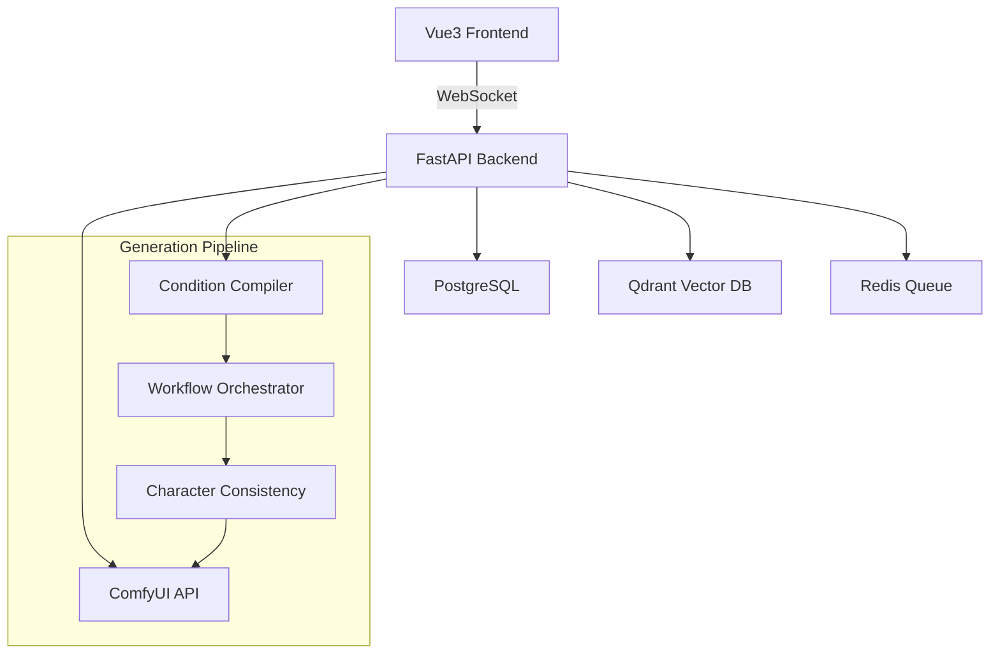

# Tower Anime Production Orchestration System

Production-ready anime generation system with real-time orchestration, dual database architecture, and WebSocket integration.

## 🎯 System Overview

A comprehensive animation orchestration platform combining:
- **PostgreSQL**: Project metadata, job tracking, character profiles
- **Qdrant**: Vector embeddings for semantic search and character consistency
- **ComfyUI**: AI image/video generation pipeline
- **Vue3/TypeScript**: Real-time frontend with WebSocket integration
- **FastAPI**: High-performance async backend



## ⚡ Quick Start

### Prerequisites
- Python 3.11+
- Node.js 18+
- PostgreSQL 13+
- Qdrant vector database
- Redis server
- ComfyUI installation

### Installation

```bash
# Clone and setup backend
git clone <repository-url>
cd tower-anime-production

# Backend setup
python -m venv venv
source venv/bin/activate
pip install -r requirements.txt

# Database setup
python setup_database.py

# Frontend setup
cd frontend
npm install
npm run dev

# Start services
python api/main.py
```

## 🏗️ Architecture

### Core Components

#### 1. Workflow Orchestrator (`/api/orchestration/workflow_orchestrator.py`)
Central conductor managing the entire generation pipeline:
- Priority-based job queue with Redis backend
- Concurrent job processing (configurable workers)
- Progress tracking and real-time updates
- Error recovery and retry logic

```python
class WorkflowOrchestrator:
    def __init__(self, postgres_config, redis_url, comfyui_url, qdrant_url):
        self.max_concurrent_jobs = 3
        self.worker_count = 2

    async def submit_generation(self, request: SceneGenerationRequest) -> str:
        # Submits job to priority queue

    async def _process_job(self, job_data: dict):
        # Processes individual generation jobs
```

#### 2. Condition Compiler (`/api/orchestration/condition_compiler.py`)
Intelligent workflow compilation supporting 8 condition types:
- `TEXT_PROMPT`: Natural language descriptions
- `CHARACTER_IDENTITY`: Character-specific embeddings
- `POSE_CONTROL`: ControlNet pose guidance
- `STYLE_REFERENCE`: Style consistency
- `LIGHTING_CONDITION`: Environmental lighting
- `CAMERA_ANGLE`: Shot composition
- `EMOTION_STATE`: Character emotional expression
- `SCENE_COMPOSITION`: Layout and framing

#### 3. Character Consistency Manager (`/api/orchestration/character_consistency.py`)
Maintains visual character coherence across generations:
- CLIP-based visual embeddings
- IPAdapter integration for consistency
- Character profile management
- Reference image processing

#### 4. Unified Embedding Pipeline (`/api/orchestration/unified_embedding_pipeline.py`)
Dual embedding system for semantic search:
- **Visual Embeddings**: CLIP ViT-B/32 for images
- **Text Embeddings**: Sentence Transformers for descriptions
- **Storage**: Qdrant vector database with 384D vectors
- **Search**: Semantic similarity for character/style matching

### Database Schema

#### PostgreSQL Tables
- **generation_jobs**: Job tracking with progress and results
- **character_profiles**: Character definitions and metadata
- **animation_projects**: Project organization and scenes
- **unified_embeddings**: Embedding metadata and references
- **asset_registry**: Generated asset management

#### Qdrant Collections
- **character_embeddings**: Character visual features
- **style_embeddings**: Artistic style vectors
- **scene_embeddings**: Scene composition patterns

## 🎨 Frontend Integration

### Vue3 Components

#### SceneGenerator.vue
Main generation interface with real-time progress:
```vue
<template>
  <div class="scene-generator">
    <form @submit.prevent="generateScene">
      <input v-model="prompt" placeholder="Describe your scene..." />
      <button :disabled="generating">Generate Scene</button>
    </form>
    <ProgressBar v-if="generating" :progress="progress" />
  </div>
</template>
```

#### Pinia Store Integration
```typescript
export const useOrchestrationStore = defineStore('orchestration', () => {
  const generateScene = async (request: SceneGenerationRequest): Promise<string> => {
    const response = await $fetch('/api/anime/generate/scene', {
      method: 'POST',
      body: request
    })

    // Connect WebSocket for real-time updates
    await websocketService.connect(response.job_id)

    return response.job_id
  }
})
```

### Real-time Updates

#### WebSocket Service
```typescript
export class WebSocketService {
  async connect(jobId: string): Promise<void> {
    this.ws = new WebSocket(`ws://localhost:8000/ws/jobs/${jobId}`)

    this.ws.onmessage = (event) => {
      const update = JSON.parse(event.data)
      orchestrationStore.updateProgress(update)
    }
  }

  // SSE fallback for environments without WebSocket support
  connectSSE(jobId: string): EventSource {
    return new EventSource(`/api/anime/jobs/${jobId}/stream`)
  }
}
```

## 📡 API Endpoints

### Generation Endpoints
- `POST /api/anime/generate/scene` - Submit scene generation
- `GET /api/anime/jobs/{job_id}` - Get job status
- `GET /api/anime/jobs/{job_id}/stream` - SSE progress stream
- `WebSocket /ws/jobs/{job_id}` - Real-time job updates

### Character Management
- `GET /api/anime/characters` - List characters
- `POST /api/anime/characters` - Create character
- `GET /api/anime/characters/{id}` - Get character details
- `PUT /api/anime/characters/{id}` - Update character
- `GET /api/anime/characters/{id}/embeddings` - Character embeddings

### Project Management
- `GET /api/anime/projects` - List projects
- `POST /api/anime/projects` - Create project
- `GET /api/anime/projects/{id}` - Project details
- `POST /api/anime/projects/{id}/scenes` - Add scene to project

### Search & Discovery
- `POST /api/anime/search/characters` - Semantic character search
- `POST /api/anime/search/similar` - Find similar content
- `GET /api/anime/embeddings/{type}` - List embeddings by type

## 🚀 Deployment

### Production Setup

#### 1. System Service
```bash
# Create systemd service
sudo cp tower-anime-production.service /etc/systemd/system/
sudo systemctl daemon-reload
sudo systemctl enable tower-anime-production
sudo systemctl start tower-anime-production
```

#### 2. Nginx Configuration
```nginx
location /api/anime/ {
    proxy_pass http://localhost:8328/;
    proxy_set_header Host $host;
    proxy_set_header X-Real-IP $remote_addr;
}

location /ws/jobs/ {
    proxy_pass http://localhost:8328;
    proxy_http_version 1.1;
    proxy_set_header Upgrade $http_upgrade;
    proxy_set_header Connection "upgrade";
}
```

#### 3. Environment Configuration
```bash
# Production environment variables
POSTGRES_HOST=localhost
POSTGRES_DB=tower_consolidated
POSTGRES_USER=patrick
POSTGRES_PASSWORD=tower_echo_brain_secret_key_2025
REDIS_URL=redis://localhost:6379
QDRANT_URL=http://localhost:6333
COMFYUI_URL=http://localhost:8188
```

### Docker Deployment
```dockerfile
FROM python:3.11-slim

WORKDIR /app
COPY requirements.txt .
RUN pip install -r requirements.txt

COPY . .
EXPOSE 8328

CMD ["uvicorn", "api.main:app", "--host", "0.0.0.0", "--port", "8328"]
```

## 🔧 Configuration

### Performance Tuning
```python
# workflow_orchestrator.py
class WorkflowOrchestrator:
    def __init__(self):
        self.max_concurrent_jobs = 3  # Adjust based on GPU memory
        self.worker_count = 2         # CPU worker threads
        self.retry_attempts = 3       # Job retry limit
        self.progress_update_interval = 1.0  # Seconds
```

### Database Optimization
```sql
-- Essential indexes for performance
CREATE INDEX CONCURRENTLY idx_generation_jobs_status ON generation_jobs(status);
CREATE INDEX CONCURRENTLY idx_generation_jobs_created_at ON generation_jobs(created_at);
CREATE INDEX CONCURRENTLY idx_character_profiles_name ON character_profiles(name);
CREATE INDEX CONCURRENTLY idx_unified_embeddings_type ON unified_embeddings(embedding_type);
```

## 🧪 Testing

### Integration Tests
```bash
# Run comprehensive integration tests
python simple_integration_test.py

# Expected output:
# ✅ PostgreSQL Connection: PASS
# ✅ Qdrant Connection: PASS
# ✅ Embedding Pipeline: PASS
# ✅ Condition Compiler: PASS
# ✅ Character Consistency: PASS
# ✅ WebSocket Service: PASS
```

### API Testing
```bash
# Test scene generation endpoint
curl -X POST http://localhost:8328/api/anime/generate/scene \
  -H "Content-Type: application/json" \
  -d '{
    "scene_id": "test_001",
    "storyline_text": "A brave samurai stands ready for battle",
    "conditions": [
      {
        "type": "TEXT_PROMPT",
        "data": {"prompt": "anime samurai warrior"},
        "weight": 1.0
      }
    ]
  }'
```

## 🐛 Troubleshooting

### Common Issues

#### 1. Torch Version Warning
```
ValueError: Due to a serious vulnerability issue in torch.load
```
**Solution**: Upgrade to torch>=2.6.0
```bash
pip install torch>=2.6.0 torchvision torchaudio
```

#### 2. Database Connection Failed
```
psycopg2.OperationalError: could not connect to server
```
**Solution**: Verify PostgreSQL service and credentials
```bash
sudo systemctl status postgresql
psql -h localhost -U patrick -d tower_consolidated -c "SELECT 1;"
```

#### 3. Qdrant Connection Issues
```
httpx.ConnectError: [Errno 111] Connection refused
```
**Solution**: Start Qdrant service
```bash
docker run -p 6333:6333 qdrant/qdrant
# OR
sudo systemctl start qdrant
```

#### 4. ComfyUI Generation Fails
```
ComfyUI error: 400
```
**Solution**: Check ComfyUI models and workflow compatibility
```bash
curl http://localhost:8188/system_stats
ls ~/.cache/huggingface/hub/  # Check model availability
```

### Performance Monitoring
```bash
# Monitor system resources
htop
nvidia-smi

# Check service logs
sudo journalctl -u tower-anime-production -f

# Monitor database performance
psql -h localhost -U patrick -d tower_consolidated \
  -c "SELECT * FROM pg_stat_activity WHERE application_name LIKE '%anime%';"
```

## 🎯 Production Optimization

### Resource Management
- **GPU Memory**: Monitor VRAM usage during concurrent generation
- **Database Connections**: Use connection pooling (default: 20 connections)
- **Vector Index**: Qdrant HNSW indexing for fast similarity search
- **Caching**: Redis for job state and frequent queries

### Scaling Considerations
- **Horizontal**: Multiple worker instances with shared Redis queue
- **Vertical**: Increase worker_count based on CPU cores
- **Database**: Read replicas for search operations
- **Storage**: Separate SSD for generated assets

## 🔒 Security

### Authentication
Integration with Tower auth service (port 8088):
```python
from tower_auth import verify_jwt_token

@app.middleware("http")
async def auth_middleware(request: Request, call_next):
    token = request.headers.get("Authorization")
    if not verify_jwt_token(token):
        raise HTTPException(401, "Unauthorized")
```

### Data Protection
- Environment variables for sensitive configuration
- JWT tokens for API authentication
- Input validation for all endpoints
- Rate limiting for generation endpoints

---

## 📚 Additional Resources

- **ComfyUI Documentation**: https://github.com/comfyanonymous/ComfyUI
- **Qdrant Vector Database**: https://qdrant.tech/documentation/
- **Vue3 Composition API**: https://vuejs.org/guide/composition-api/
- **FastAPI Documentation**: https://fastapi.tiangolo.com/

## 🤝 Contributing

1. Follow existing code patterns and TypeScript interfaces
2. Add tests for new features
3. Update documentation for API changes
4. Ensure proper error handling and logging

---

**Status**: ✅ Production Ready | **Version**: 3.0 | **Last Updated**: 2025-12-19