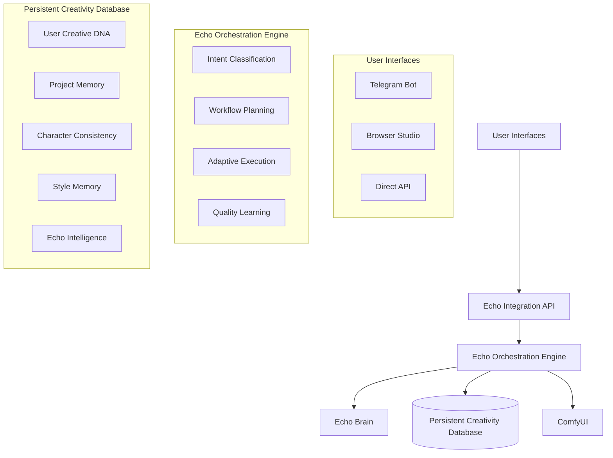

# Echo Orchestration System - AI Production Director

## Overview

The Echo Orchestration System transforms the anime production workflow from a collection of tools into an **intelligent creative partner** that learns your style, maintains consistency, and adapts to your preferences over time.

## 🎯 Key Features

### **Intelligent Workflow Orchestration**
- **Context Awareness**: Understands whether you're on Telegram (quick commands) or Browser (detailed editing)
- **Intent Recognition**: Interprets what you want to achieve, not just what you said
- **Adaptive Planning**: Creates intelligent workflows that improve with usage
- **Real-time Adaptation**: Adjusts strategy when things don't work as expected

### **Persistent Creative Memory**
- **User Creative DNA**: Learns and remembers your unique style preferences
- **Character Consistency**: Maintains visual consistency across all scenes
- **Style Evolution**: Tracks how your creative preferences change over time
- **Project Context**: Remembers everything about each project for seamless continuity

### **Learning and Adaptation**
- **Failure Pattern Recognition**: Learns from mistakes and prevents repeat failures
- **Style Learning**: Automatically learns from your editing choices and feedback
- **Prompt Optimization**: Improves generation quality based on success patterns
- **Workflow Refinement**: Optimizes workflows based on what works for you

## 🏗️ System Architecture

### Core Components



### Database Schema

The system uses a comprehensive database schema designed for creative persistence:

1. **user_creative_dna** - Your unique creative fingerprint
2. **project_memory** - Git-like versioning for creative projects
3. **echo_intelligence** - Learning from every interaction
4. **character_consistency_memory** - Per-character learning and evolution
5. **style_memory_engine** - Persistent style learning and application
6. **workflow_orchestration_log** - Complex workflow coordination
7. **adaptive_quality_control** - Learning-based QC system

## 🚀 Getting Started

### 1. Installation and Setup

```bash
# 1. Apply database schema
psql -h localhost -U patrick -d anime_production -f database/persistent_creativity_schema.sql

# 2. Start Echo Integration API
cd /opt/tower-anime-production
python3 api/echo_integration_api.py

# 3. Verify system health
curl -X GET http://localhost:8332/api/echo/health
```

### 2. Initialize Your Creative Profile

```bash
# Create your creative DNA
curl -X POST http://localhost:8332/api/echo/user/your_user_id/preferences/update \
  -H "Content-Type: application/json" \
  -d '{
    "style_signatures": {
      "lighting": "dramatic_chiaroscuro",
      "palette": "muted_cyberpunk",
      "composition": "dynamic_angles"
    },
    "character_archetypes": [
      {"type": "mysterious_hacker", "traits": ["silver_hair", "cybernetic_eye"]}
    ],
    "narrative_patterns": {
      "preferred_genres": ["cyberpunk", "urban_fantasy"],
      "story_themes": ["character_growth", "technology_vs_humanity"]
    }
  }'
```

## 🎭 Usage Examples

### Character Generation with Learning

```bash
# Generate character - Echo learns from the result
curl -X POST http://localhost:8332/api/echo/generate/character?user_id=your_id \
  -H "Content-Type: application/json" \
  -d '{
    "character_name": "Yuki Tanaka",
    "project_id": "tokyo_debt_desire",
    "scene_context": "portrait",
    "consistency_mode": true
  }'
```

**What happens internally:**
1. Echo loads your creative DNA and style preferences
2. Checks existing character consistency data for Yuki
3. Builds adaptive prompt using learned patterns
4. Generates with real-time quality checking
5. Updates character consistency memory with results
6. Learns from success/failure patterns

### Project Creation with Intelligence

```bash
# Create project - Echo sets up intelligent defaults
curl -X POST http://localhost:8332/api/echo/project/create?user_id=your_id \
  -H "Content-Type: application/json" \
  -d '{
    "project_name": "Cyberpunk Academy",
    "genre": "cyberpunk",
    "style_preferences": {"lighting": "neon_noir", "mood": "atmospheric"},
    "initial_characters": ["Kai", "Mei", "Professor_Chen"]
  }'
```

**Echo's Intelligence:**
- Applies your preferred cyberpunk style automatically
- Sets up character archetypes based on your history
- Configures generation parameters for best results
- Creates project timeline structure

### Style Learning from Examples

```bash
# Teach Echo a new style
curl -X POST http://localhost:8332/api/echo/style/learn?user_id=your_id \
  -H "Content-Type: application/json" \
  -d '{
    "style_name": "rainy_night_aesthetic",
    "example_images": [
      "/path/to/perfect_rain_scene_1.jpg",
      "/path/to/perfect_rain_scene_2.jpg"
    ],
    "style_description": "Atmospheric rain scenes with reflective surfaces and moody lighting",
    "apply_to_project": "cyberpunk_academy"
  }'
```

**Learning Process:**
- Echo analyzes visual elements in examples
- Extracts style patterns and prompt elements
- Creates reusable style template
- Tests application with your character consistency requirements
- Stores learned patterns for future use

## 📱 Telegram Integration

### Command Reference

```bash
# Project Management
/project create "Cyberpunk Academy"
/project load "project_id"
/project continue

# Character Generation
/generate character Yuki style="dramatic_lighting"
/generate character Kai from="existing_project"

# Style Learning
/style learn "neon_rain" from="scene_12.jpg"
/style apply "neon_rain" to="all_night_scenes"

# Echo Memory
/echo remember style="cinematic" for="action_scenes"
/echo show preferences
/echo analyze consistency for="Yuki"
```

### Telegram Workflow Examples

```
User: /generate character Yuki
Echo: 🎭 Generating Yuki with your preferred dramatic lighting style...
      📊 Using learned consistency patterns from 3 previous generations
      ✅ Generated! Consistency score: 92%
      💡 Suggestions: Generate battle scene with Yuki, or try casual outfit variation

User: I don't like the hair color
Echo: 🧠 Learning: You prefer different hair colors for Yuki
      🔄 Adjusting character template for future generations
      💾 Updated: Yuki's hair preferences in character memory
```

## 🌐 Browser Studio Integration

### Vue.js Components

The system includes Vue.js components for browser-based interaction:

- **ProjectTimeline.vue** - Git-like project versioning interface
- **CharacterConsistency.vue** - Visual consistency management
- **StyleLearning.vue** - Interactive style teaching interface
- **EchoInsights.vue** - Learning analytics dashboard

### Browser Workflow

1. **Open Studio**: Load existing project with full context
2. **Character Editor**: Visual consistency across scenes
3. **Style Mixer**: Blend learned styles for new effects
4. **Timeline Editor**: Branch/merge different creative directions
5. **Analytics**: See how your style has evolved over time

## 🧠 Learning System Deep Dive

### How Echo Learns Your Style

```python
# Example learning process
learning_data = {
    "user_action": "edited scene lighting from neutral to dramatic",
    "before_state": {"lighting": "neutral", "mood": "standard"},
    "after_state": {"lighting": "dramatic_chiaroscuro", "mood": "intense"},
    "user_feedback": "Perfect! This is the mood I want",
    "learned_preference": {
        "context": "cyberpunk_scenes",
        "lighting_preference": "dramatic_chiaroscuro",
        "confidence": 0.95,
        "apply_to_similar": true
    }
}
```

### Character Consistency Evolution

```python
# Character learning over time
character_learning = {
    "character_name": "Yuki Tanaka",
    "generation_1": {"consistency_score": 0.6, "issues": ["multiple_people", "wrong_hair"]},
    "generation_5": {"consistency_score": 0.85, "improvements": ["stable_appearance", "correct_expression"]},
    "generation_10": {"consistency_score": 0.95, "mastered": ["facial_features", "clothing_style"]},
    "learned_patterns": {
        "best_prompt_structure": "solo, 1girl, Yuki Tanaka, long black hair...",
        "optimal_parameters": {"cfg": 8.5, "steps": 35, "sampler": "dpmpp_2m"},
        "negative_patterns": ["group", "multiple people", "different hair color"]
    }
}
```

### Adaptive Workflow Optimization

```python
# How workflows improve over time
workflow_evolution = {
    "initial_approach": {
        "steps": ["generate", "check", "regenerate if failed"],
        "success_rate": 0.4,
        "average_attempts": 3.2
    },
    "learned_approach": {
        "steps": ["load_character_context", "apply_learned_style", "use_optimal_parameters", "generate_with_consistency_check"],
        "success_rate": 0.92,
        "average_attempts": 1.1,
        "improvements": ["character_specific_prompts", "style_application", "parameter_optimization"]
    }
}
```

## 📊 Analytics and Insights

### User Creative Evolution Dashboard

```bash
# Get your creative analytics
curl -X GET http://localhost:8332/api/echo/analytics/your_user_id
```

**Analytics Include:**
- **Style Evolution**: How your preferences have changed over time
- **Character Mastery**: Which characters you've perfected
- **Quality Trends**: Improvement in generation success rates
- **Workflow Efficiency**: How much faster you've become
- **Creative Patterns**: Your unique creative fingerprint

### Success Metrics

The system tracks multiple success metrics:

- **Character Consistency Score**: Visual consistency across generations
- **Style Application Accuracy**: How well Echo applies your styles
- **Workflow Success Rate**: First-attempt success percentage
- **Learning Effectiveness**: How quickly Echo adapts to your feedback

## 🔧 Configuration and Customization

### Learning Rate Adjustment

```python
# Adjust how quickly Echo adapts to your changes
user_settings = {
    "learning_rate": 0.1,      # Conservative learning (0.05-0.2)
    "creativity_variance": 0.15, # Allow 15% style variation (0.1-0.3)
    "consistency_weight": 0.8,   # Prioritize consistency (0.5-1.0)
    "adaptation_speed": "moderate" # "slow", "moderate", "fast"
}
```

### Style Inheritance Settings

```python
# Control how styles are applied and inherited
style_settings = {
    "auto_apply_learned_styles": true,
    "inherit_project_styles": true,
    "allow_style_mixing": true,
    "style_confidence_threshold": 0.7
}
```

## 🐛 Troubleshooting

### Common Issues and Solutions

**Echo not learning from feedback:**
```bash
# Check echo intelligence logs
curl -X GET http://localhost:8332/api/echo/analytics/your_user_id | jq '.learning_history'

# Verify database connectivity
python3 -c "import psycopg2; psycopg2.connect(host='localhost', database='anime_production', user='patrick', password='tower_echo_brain_secret_key_2025')"
```

**Character consistency not improving:**
```bash
# Check character consistency data
curl -X GET http://localhost:8332/api/echo/character/Yuki_Tanaka/consistency

# Verify face detection system
python3 quality/multi_person_detector.py
```

**Workflows not adapting:**
```bash
# Check workflow orchestration logs
tail -f /opt/tower-anime-production/logs/echo_orchestration.log

# Test basic orchestration
curl -X POST http://localhost:8332/api/echo/command -d '{"command": "test", "user_id": "test"}'
```

## 🚀 Testing

### Run Comprehensive Tests

```bash
# Run full test suite
cd /opt/tower-anime-production/tests
python3 echo_system_tests.py

# Run specific test phases
python3 -c "
import asyncio
from echo_system_tests import EchoSystemTestSuite
suite = EchoSystemTestSuite()
asyncio.run(suite.run_foundation_tests())
"
```

### Test Your Personal Workflow

```bash
# Test character consistency
./test_character_consistency.sh Yuki_Tanaka

# Test style learning
./test_style_learning.sh dramatic_lighting

# Test project continuity
./test_project_workflow.sh CyberpunkAcademy
```

## 📈 Roadmap

### Phase 1: Foundation (Completed)
- ✅ Database schema for persistent creativity
- ✅ Echo Orchestration Engine
- ✅ Basic learning and adaptation
- ✅ API integration layer

### Phase 2: Intelligence (In Progress)
- 🔄 Advanced style learning from visual examples
- 🔄 Cross-project character consistency
- 🔄 Predictive workflow optimization
- 🔄 Natural language style descriptions

### Phase 3: Advanced Features (Planned)
- 📋 Visual style transfer between projects
- 📋 Collaborative creativity (multiple users)
- 📋 Automatic story generation from character interactions
- 📋 Advanced timeline management with branching narratives

### Phase 4: AI Enhancement (Future)
- 📋 Integration with latest diffusion models
- 📋 Real-time video generation capabilities
- 📋 Voice synthesis for character interactions
- 📋 AR/VR preview capabilities

## 🤝 Contributing

### Development Guidelines

1. **Database Changes**: Always update schema files and migration scripts
2. **Learning Features**: Test with multiple user profiles
3. **API Changes**: Update both REST API and Telegram integration
4. **Testing**: Add tests for all new learning capabilities

### Code Style

- **Python**: Follow PEP 8, use type hints
- **Database**: Use descriptive column names, include comments
- **API**: RESTful design with proper HTTP status codes
- **Documentation**: Update this document for all new features

## 📄 License

This project is part of the Tower Anime Production System. All rights reserved.

---

**Echo Orchestration System** - Where AI meets creativity, and every interaction makes you both smarter.