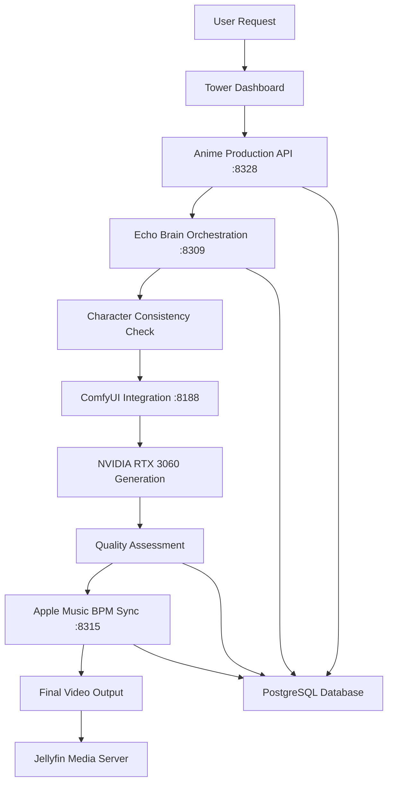

# Tower Anime Production System - Complete API Documentation

## System Architecture Overview

The Tower Anime Production System is a comprehensive studio-grade anime production pipeline consisting of multiple microservices that work together to create professional anime content. The system integrates AI generation, audio synchronization, character management, and project orchestration.

### Core Services

1. **Anime Production API (Port 8328)** - Main production pipeline
2. **Episode Management Service (Port 8323)** - Episode CRUD operations
3. **ComfyUI Integration (Port 8188)** - AI video/image generation
4. **Apple Music BPM Integration (Port 8315)** - Audio analysis and sync
5. **Echo Brain Orchestration (Port 8309)** - AI director and orchestrator

## Database Schema

### PostgreSQL Database: `anime_production`

The system uses PostgreSQL with two main schemas:

#### `anime_api` Schema (Main API Tables)
```sql
-- Core project management
anime_projects              -- Project definitions
projects                   -- Extended project data
characters                 -- Character definitions and versions
scenes                     -- Scene management with branching
project_bibles            -- Project narrative bibles
bible_characters          -- Character definitions in project bibles
bible_history             -- Project bible change history

-- Production workflow
production_jobs            -- Generation job queue
quality_metrics           -- Quality assessment data
generation_analytics       -- Performance metrics
style_templates           -- Reusable style definitions

-- Git-like versioning
branches                   -- Project branches
commits                    -- Project commits
tags                      -- Version tags

-- Audio integration
music_scene_sync          -- Audio-video synchronization
user_creative_preferences -- User preference storage

-- Orchestration
echo_orchestration_logs   -- Echo Brain coordination logs
story_timelines          -- Narrative timeline management
storyline_context        -- Story context tracking
```

#### `public` Schema (Extended Features)
```sql
episodes                  -- Episode management
assets                   -- Media asset tracking
character_appearances    -- Character appearance history
story_arcs              -- Narrative arc management
generation_requests     -- AI generation requests
quality_assessments     -- Quality control data
render_queue            -- Processing queue
workflows               -- ComfyUI workflow definitions
learning_models         -- AI model management
training_examples       -- Learning data
production_schedule     -- Timeline management
feedback                -- User feedback
creative_decisions      -- Decision tracking
cultural_elements       -- Cultural context
cultural_validations    -- Cultural accuracy checks
```

---

## 1. Anime Production API (Port 8328)

**Base URL:** `http://localhost:8328/api/anime`
**Service:** `tower-anime-production`
**Technology:** FastAPI with PostgreSQL

### Core Endpoints

#### Health Check
```bash
# Health status
curl http://localhost:8328/api/anime/health
```

**Response:**
```json
{
  "status": "healthy",
  "service": "tower-anime-production"
}
```

#### Project Management

##### Create Project
```bash
curl -X POST http://localhost:8328/api/anime/projects \
  -H "Content-Type: application/json" \
  -d '{
    "name": "My Anime Project",
    "description": "Epic fantasy adventure",
    "metadata": {
      "genre": "fantasy",
      "target_length": "12_episodes"
    }
  }'
```

**Response:**
```json
{
  "id": "12",
  "name": "My Anime Project",
  "description": "Epic fantasy adventure",
  "status": "active",
  "created_at": "2025-11-05T04:46:12Z",
  "updated_at": "2025-11-05T04:46:12Z",
  "metadata": {
    "genre": "fantasy",
    "target_length": "12_episodes"
  }
}
```

##### List Projects
```bash
curl http://localhost:8328/api/anime/projects
```

##### Get Project Details
```bash
curl http://localhost:8328/api/anime/projects/{project_id}
```

#### Character Management

##### Create Character
```bash
curl -X POST http://localhost:8328/api/anime/characters \
  -H "Content-Type: application/json" \
  -d '{
    "project_id": 1,
    "name": "Kai Nakamura",
    "description": "Main protagonist, skilled fighter",
    "image_path": "/path/to/reference.jpg",
    "comfyui_workflow": "anime_character_v2"
  }'
```

**Response:**
```json
{
  "id": 1,
  "project_id": 1,
  "name": "Kai Nakamura",
  "description": "Main protagonist, skilled fighter",
  "version": 1,
  "image_path": "/path/to/reference.jpg",
  "comfyui_workflow": "anime_character_v2",
  "created_at": "2025-11-05T04:46:12Z",
  "updated_at": "2025-11-05T04:46:12Z"
}
```

##### List Characters
```bash
curl http://localhost:8328/api/anime/characters?project_id=1
```

##### Update Character
```bash
curl -X PUT http://localhost:8328/api/anime/characters/1 \
  -H "Content-Type: application/json" \
  -d '{
    "description": "Updated character description",
    "image_path": "/new/path/to/reference.jpg"
  }'
```

#### Scene Management

##### Create Scene
```bash
curl -X POST http://localhost:8328/api/anime/scenes \
  -H "Content-Type: application/json" \
  -d '{
    "project_id": 1,
    "branch_name": "main",
    "scene_number": 1,
    "description": "Opening scene in the village",
    "characters": ["Kai Nakamura", "Village Elder"]
  }'
```

##### List Scenes
```bash
curl http://localhost:8328/api/anime/scenes?project_id=1
```

##### Update Scene
```bash
curl -X PUT http://localhost:8328/api/anime/scenes/1 \
  -H "Content-Type: application/json" \
  -d '{
    "description": "Updated scene description",
    "video_path": "/path/to/generated/video.mp4"
  }'
```

#### Project Bible Management

##### Create Project Bible
```bash
curl -X POST http://localhost:8328/api/anime/projects/1/bible \
  -H "Content-Type: application/json" \
  -d '{
    "title": "Project Bible v1.0",
    "description": "Complete narrative guide",
    "content": {
      "world_building": "Fantasy realm with magic system",
      "character_arcs": {...},
      "plot_outline": [...]
    }
  }'
```

##### Get Project Bible
```bash
curl http://localhost:8328/api/anime/projects/1/bible
```

##### Add Character to Bible
```bash
curl -X POST http://localhost:8328/api/anime/projects/1/bible/characters \
  -H "Content-Type: application/json" \
  -d '{
    "name": "Kai Nakamura",
    "role": "protagonist",
    "personality": "determined, compassionate",
    "backstory": "...",
    "visual_description": "...",
    "abilities": [...]
  }'
```

#### Git-like Version Control

##### Create Branch
```bash
curl -X POST http://localhost:8328/api/anime/branch \
  -H "Content-Type: application/json" \
  -d '{
    "project_id": 1,
    "branch_name": "experimental_ending",
    "source_branch": "main"
  }'
```

##### Commit Changes
```bash
curl -X POST http://localhost:8328/api/anime/commit \
  -H "Content-Type: application/json" \
  -d '{
    "project_id": 1,
    "branch": "main",
    "message": "Added character backstory",
    "changes": {...}
  }'
```

##### List Branches
```bash
curl http://localhost:8328/api/anime/branches?project_id=1
```

##### Merge Branches
```bash
curl -X POST http://localhost:8328/api/anime/merge \
  -H "Content-Type: application/json" \
  -d '{
    "project_id": 1,
    "source_branch": "experimental_ending",
    "target_branch": "main",
    "message": "Merge experimental ending"
  }'
```

#### Audio Integration

##### Add Audio to Scene
```bash
curl -X POST http://localhost:8328/api/anime/scenes/1/audio \
  -H "Content-Type: application/json" \
  -d '{
    "audio_path": "/path/to/audio.mp3",
    "bpm": 120,
    "sync_points": [
      {"time": 0.0, "event": "scene_start"},
      {"time": 2.5, "event": "character_entrance"}
    ]
  }'
```

#### Director Commands (Echo Integration)

##### Send Director Command
```bash
curl -X POST http://localhost:8328/api/anime/director/command \
  -H "Content-Type: application/json" \
  -d '{
    "project_id": 1,
    "command": "generate_scene",
    "parameters": {
      "scene_id": 1,
      "style": "cinematic",
      "duration": 5,
      "quality": "high"
    }
  }'
```

#### Video Generation

##### Generate from Command
```bash
curl -X POST http://localhost:8328/api/anime/projects/1/generate-from-command \
  -H "Content-Type: application/json" \
  -d '{
    "prompt": "Kai Nakamura standing in a mystical forest, cinematic lighting",
    "duration": 5,
    "style": "anime",
    "characters": ["Kai Nakamura"],
    "quality": "high"
  }'
```

**Response:**
```json
{
  "generation_id": "gen_12345",
  "status": "processing",
  "estimated_completion": "2025-11-05T04:50:00Z",
  "project_id": 1,
  "metadata": {
    "duration": 5,
    "style": "anime",
    "quality": "high"
  }
}
```

---

## 2. Episode Management Service (Port 8323)

**Base URL:** `http://localhost:8323/api/anime`
**Service:** `episodes-api`
**Technology:** FastAPI with PostgreSQL

### Endpoints

#### Health Check
```bash
curl http://localhost:8323/api/anime/health
```

**Response:**
```json
{
  "status": "healthy",
  "service": "episodes-api"
}
```

#### List Episodes
```bash
curl http://localhost:8323/api/anime/episodes
```

**Response:**
```json
[
  {
    "id": "uuid-1234",
    "episode_number": 1,
    "title": "The Beginning",
    "synopsis": "Our hero's journey starts...",
    "duration": "24:30",
    "status": "completed",
    "scenes": ["scene_1", "scene_2", "scene_3"],
    "characters": ["Kai Nakamura", "Village Elder"],
    "metadata": {
      "genre": "fantasy",
      "mood": "adventurous"
    },
    "video_path": "/path/to/episode1.mp4",
    "quality_score": 8.5,
    "created_at": "2025-11-05T04:46:12Z",
    "updated_at": "2025-11-05T04:46:12Z"
  }
]
```

---

## 3. ComfyUI Integration (Port 8188)

**Base URL:** `http://localhost:8188`
**Service:** ComfyUI
**Technology:** ComfyUI Web Interface + API

### Web Interface
```bash
# Access ComfyUI web interface
curl http://localhost:8188/
```

### API Endpoints

#### Submit Workflow
```bash
curl -X POST http://localhost:8188/prompt \
  -H "Content-Type: application/json" \
  -d '{
    "prompt": {
      "workflow_definition": {...},
      "positive_prompt": "Kai Nakamura, anime style, cinematic lighting",
      "negative_prompt": "blurry, low quality",
      "steps": 20,
      "cfg_scale": 7.5,
      "duration_frames": 120
    },
    "client_id": "anime_production_1"
  }'
```

**Response:**
```json
{
  "prompt_id": "12345-abcde-67890",
  "number": 42
}
```

#### Check Generation Status
```bash
curl http://localhost:8188/history/12345-abcde-67890
```

#### Get Queue Status
```bash
curl http://localhost:8188/queue
```

#### Get System Stats
```bash
curl http://localhost:8188/system_stats
```

**Response:**
```json
{
  "devices": [
    {
      "name": "NVIDIA GeForce RTX 3060",
      "type": "cuda",
      "index": 0,
      "vram_total": 12884901888,
      "vram_free": 3221225472
    }
  ],
  "queue": {
    "pending": 0,
    "running": 1
  }
}
```

---

## 4. Apple Music BPM Integration (Port 8315)

**Base URL:** `http://localhost:8315/api`
**Service:** `tower-apple-music`
**Technology:** FastAPI with librosa

### Core Endpoints

#### Health Check
```bash
curl http://localhost:8315/api/health
```

**Response:**
```json
{
  "status": "healthy",
  "service": "tower-apple-music",
  "version": "2.0",
  "features": {
    "audio_quality_monitoring": true,
    "music_library": true,
    "streaming": true,
    "search": true
  }
}
```

#### BPM Analysis

##### BPM Health Check
```bash
curl http://localhost:8315/api/bpm/health
```

**Response:**
```json
{
  "status": "healthy",
  "service": "bpm-analyzer",
  "dependencies": {
    "librosa": "0.11.0",
    "numpy": "2.3.3"
  },
  "cache_dir": "/opt/tower-apple-music/data/analysis_cache",
  "cached_analyses": 0
}
```

##### Analyze Track BPM
```bash
curl -X POST http://localhost:8315/api/bpm/analyze-track \
  -H "Content-Type: application/json" \
  -d '{
    "audio_path": "/path/to/audio.mp3",
    "analysis_type": "detailed"
  }'
```

**Response:**
```json
{
  "bpm": 120.5,
  "confidence": 0.95,
  "tempo_changes": [
    {"time": 0.0, "bpm": 120.5},
    {"time": 45.2, "bpm": 118.0}
  ],
  "beat_times": [0.0, 0.5, 1.0, 1.5],
  "analysis_duration": 2.3,
  "metadata": {
    "duration": 180.5,
    "sample_rate": 44100
  }
}
```

##### Sync Analysis with Video
```bash
curl -X POST http://localhost:8315/api/bpm/sync-analysis \
  -H "Content-Type: application/json" \
  -d '{
    "audio_path": "/path/to/audio.mp3",
    "video_duration": 5.0,
    "target_fps": 24,
    "sync_points": [
      {"audio_time": 0.0, "video_frame": 0},
      {"audio_time": 2.5, "video_frame": 60}
    ]
  }'
```

##### Find Matching Tracks
```bash
curl "http://localhost:8315/api/bpm/find-matching?target_bpm=120&tolerance=5"
```

#### Music Library

##### Search Library
```bash
curl "http://localhost:8315/api/search?q=epic%20orchestral&limit=10"
```

##### Get Playlists
```bash
curl http://localhost:8315/api/playlists
```

##### Get Track Info
```bash
curl http://localhost:8315/api/track/12345
```

---

## 5. Echo Brain Orchestration (Port 8309)

**Base URL:** `http://localhost:8309/api/echo`
**Service:** `tower-echo-brain`
**Technology:** FastAPI with Ollama integration

### Core Endpoints

#### Health Check
```bash
curl http://localhost:8309/api/echo/health
```

**Response:**
```json
{
  "status": "healthy",
  "service": "echo-brain",
  "version": "1.0.0",
  "architecture": "modular",
  "database": "connected",
  "timestamp": "2025-11-05T04:46:12.443020",
  "modules": {
    "intelligence_router": true,
    "conversation_manager": true,
    "testing_framework": true,
    "database": true,
    "safe_executor": true
  }
}
```

#### Anime Orchestration

##### Query Echo for Anime Tasks
```bash
curl -X POST http://localhost:8309/api/echo/query \
  -H "Content-Type: application/json" \
  -d '{
    "query": "Create a 5-second anime scene with Kai Nakamura in a mystical forest",
    "context": {
      "project_id": 1,
      "character_references": ["Kai Nakamura"],
      "style": "cinematic",
      "duration": 5
    },
    "conversation_id": "anime_production_session"
  }'
```

**Response:**
```json
{
  "response": "I'll orchestrate the generation of a 5-second cinematic anime scene...",
  "action_plan": [
    {
      "step": 1,
      "action": "character_consistency_check",
      "service": "anime_production",
      "parameters": {"character": "Kai Nakamura"}
    },
    {
      "step": 2,
      "action": "generate_video",
      "service": "comfyui",
      "parameters": {
        "prompt": "enhanced_prompt_here",
        "duration": 5,
        "style": "cinematic"
      }
    },
    {
      "step": 3,
      "action": "quality_assessment",
      "service": "quality_control"
    }
  ],
  "estimated_duration": "6-8 minutes",
  "conversation_id": "anime_production_session"
}
```

##### Chat with Echo
```bash
curl -X POST http://localhost:8309/api/echo/chat \
  -H "Content-Type: application/json" \
  -d '{
    "message": "Generate an anime trailer for project 1",
    "conversation_id": "anime_chat",
    "context": {
      "service": "anime_production",
      "project_id": 1
    }
  }'
```

#### System Monitoring

##### Get System Metrics
```bash
curl http://localhost:8309/api/echo/system/metrics
```

**Response:**
```json
{
  "cpu_usage": 15.2,
  "memory_usage": 78.5,
  "gpu_usage": {
    "nvidia_rtx_3060": {
      "utilization": 45,
      "memory_used": 8192,
      "memory_total": 12288
    },
    "amd_rx_9070_xt": {
      "utilization": 23,
      "memory_used": 4096,
      "memory_total": 16384
    }
  },
  "active_tasks": 3,
  "queue_size": 1
}
```

##### Get Database Stats
```bash
curl http://localhost:8309/api/echo/db/stats
```

##### Get Current Status
```bash
curl http://localhost:8309/api/echo/status
```

---

## Data Flow Architecture

### Complete Data Flow: User Request → Video Output



### Service Integration Patterns

1. **Request Orchestration**: Echo Brain coordinates all service interactions
2. **Character Consistency**: Database-driven character reference system
3. **Quality Control**: Multi-stage assessment with feedback loops
4. **Audio Synchronization**: BPM analysis for perfect video-audio sync
5. **Version Control**: Git-like branching for project management

### Database Relationships

```sql
-- Core relationships
projects 1:N characters
projects 1:N scenes
projects 1:N project_bibles
scenes N:M characters (through scene assignments)
projects 1:N branches
branches 1:N commits

-- Production relationships
projects 1:N production_jobs
production_jobs 1:1 quality_metrics
scenes 1:N music_scene_sync
characters 1:N character_appearances
```

## Authentication & Security

All services implement:
- **CORS**: Configured for dashboard access
- **Rate Limiting**: Built-in request throttling
- **Input Validation**: Pydantic models for type safety
- **Database Security**: Connection pooling with prepared statements
- **Error Handling**: Comprehensive error responses

## Performance Specifications

### Generation Performance
- **5-second video**: 6-8 minutes generation time
- **Character consistency**: Sub-second database lookup
- **Quality assessment**: 2-3 seconds per video
- **BPM analysis**: 1-3 seconds per audio track

### Hardware Optimization
- **NVIDIA RTX 3060**: Dedicated ComfyUI generation (12GB VRAM)
- **AMD RX 9070 XT**: Ollama LLM inference (16GB VRAM)
- **Storage**: 40TB+ for asset management
- **Database**: PostgreSQL with optimized indexing

### Scaling Considerations
- Connection pooling for database efficiency
- Async operations for I/O bound tasks
- Background task queues for long-running operations
- Caching for frequently accessed data

---

## Error Handling

All services return standardized error responses:

```json
{
  "error": {
    "code": "VALIDATION_ERROR",
    "message": "Invalid character ID provided",
    "details": {
      "field": "character_id",
      "value": "invalid_id",
      "expected": "integer"
    },
    "timestamp": "2025-11-05T04:46:12Z",
    "request_id": "req_12345"
  }
}
```

## Conclusion

The Tower Anime Production System provides a complete studio-grade anime production pipeline with professional-quality output, intelligent orchestration, and comprehensive project management capabilities. The modular architecture allows for easy scaling and integration of new features while maintaining high performance and reliability.

For implementation details and advanced configuration, refer to the individual service documentation and source code in `/opt/tower-anime-production/`.